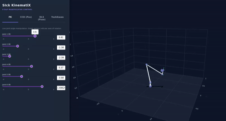
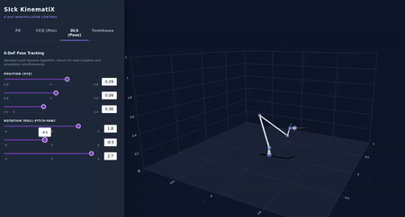

# SIckKinematiX

[](https://www.python.org/downloads/)
[]()
[](https://github.com/tomekstolarczyk/SIckKinematiX/actions/workflows/ci.yml)
[]()
[](LICENSE)

**A high-performance, universal 6-DoF Manipulator Kinematics Solver built with pure C and wrapped in a Python API.**

<p align="center">
  
  
</p>

---

> 🛑 **STOP! DON'T READ RAW CODE!**
>
> All the essential project details, including key features, complete setup steps, and the full Python API Reference, are hosted on our webiste.
>
> 🌐 **[VISIT THE OFFICIAL HOMEPAGE & DOCUMENTATION](https://tomekstolarczyk.github.io/SIckKinematiX/)**

---

## Core Repository Structure

```plaintext
SIckKinematiX/
├── .github/workflows/   # CI/CD Automated Pipelines (GitHub Actions)
├── dashboard/           # Plotly Dash Simulation App
│   └── app.py           
├── docs/                # MkDocs Documentation Website
├── sickkinematix/       # Python Extension Package Wrapper
│   └── __init__.py     
├── src/                 # Pure C Computational Engine Core
│   ├── .c     
│   ├── .h   
│   └── ...  
├── tests/               # Python Unit Tests (PyTest)
└── tests_c/             # C Unit Tests
```

## Development, Testing & Changelog
For a comprehensive breakdown of release history, implementation steps, and engineering updates, please consult the official developer logs:
📄 **[Read the CHANGELOG.md](CHANGELOG.md)**

**Python Unit Tests (pytest)**
```bash
pytest tests/
```
**Native C Engine Unit Tests**
```bash
chmod +x run_c_tests.sh
./run_c_tests.sh
```

## Resources & Acknowledgements

This project was built from scratch utilizing the following academic reviews, reference manuals, and community inspirations:

### Academic Context & Primary Inspiration
* **Course Framework:** Developed as the final project deliverable for the *Implementacja bibliotek i pakietów do analizy danych (Data Science Library Implementation, 2026)* course within the Data Science program, led by [**Prof. Marek Gągolewski**](https://github.com/gagolews) at the Faculty of Mathematics and Information Science, Warsaw University of Technology.

### Kinematics, Modeling & Optimization
* **MDH Parameters:** [*How to Calculate DH Parameters for Robotic Arms: A Beginner's Guide*](https://www.fusybots.com/post/how-to-calculate-dh-parameters-for-robotic-arms-a-beginner-s-guide) & [*Universal Robots Official Kinematics Specifications*](https://www.universal-robots.com/articles/ur/application-installation/dh-parameters-for-calculations-of-kinematics-and-dynamics/).
* **Forward Kinematics:** [*Mastering Forward Kinematics for 6-DOF Robots: A Complete Guide*](https://www.fusybots.com/post/mastering-forward-kinematics-for-6-dof-robots-a-complete-guide).
* **Inverse Kinematics Frameworks:** [*A Systematic Review of Inverse Kinematics Methods for Fixed-Base Serial Manipulators (ResearchGate)*](https://www.researchgate.net/publication/394449259_A_Systematic_Review_of_Inverse_Kinematics_Methods_for_Fixed-Base_Serial_Manipulators_Analytical_Numerical_and_Machine_Learning_Methods) and [*Inverse Kinematics: A Review of Existing Techniques (ResearchGate)*](https://www.researchgate.net/publication/273166356_Inverse_Kinematics_a_review_of_existing_techniques_and_introduction_of_a_new_fast_iterative_solver).
* **CCD Algorithm:** [*Inverse Kinematics (Robotics) – Cyclic Coordinate Descent in 3D Space*](https://jashuang1983.wordpress.com/inverse-kinematics-cyclic-coordinate-descent-in-3d-space/).
* **Damped Least Squares (DLS) & Optimization Math:** Damping factor scaling behavior near singularities operates on numerical foundations adapted from the mathematical formulation of the [*Levenberg–Marquardt Algorithm* (Wikipedia)](https://en.wikipedia.org/wiki/Levenberg%E2%80%93Marquardt_algorithm).
* **Jacobian Formulation:** [*Jacobian Matrix of a 6-DoF Serial Manipulator (Robotics StackExchange)*](https://robotics.stackexchange.com/questions/16759/jacobian-of-a-6dof-arm).
* **Orientation Error & Singularity Management:** The structural 3D rotation tracking handles potential gimbal locks by incorporating principles from the milestone paper: [*Resolved-Acceleration Control of Mechanical Manipulators* (Luh, Walker, Paul, 1980)](https://www.semanticscholar.org/paper/Resolved-acceleration-control-of-mechanical-Luh-Walker/2754691dcdf058f4e46cbb4cd4fb876397ca9ad8) and foundational mechanics detailed in [*Introduction to Robotics: Mechanics and Control*](https://dl.acm.org/doi/10.5555/1702715.1702803).
* **Workspace Point Clouds:** [*Workspace Analysis for Manipulators Framework (MathWorks Guide)*](https://www.mathworks.com/help/robotics/ug/workspace-analysis-for-manipulators.html).

### Engineering, C-Extension API & Infrastructure
* **Python C-API Integration:** Low-level object memory wrapping references the official [*Python C API Index & Specifications*](https://docs.python.org/3/c-api/index.html#c-api-index), [*Python Software Foundation Extension Guide*](https://docs.python.org/3/extending/extending.html), [*Building Python Extensions in C (Sebastiano Tronto)*](https://sebastiano.tronto.net/blog/2024-10-08-python-c/), and architectural inspirations from the open-source [*CPython Source Code Core*](https://github.com/python/cpython).
* **NumPy C-API Integration:** Memory mapping for multithreaded cloud arrays utilizes the official [*Python NumPy C-API Reference Specs*](https://numpy.org/doc/2.1/reference/c-api/index.html) and implementation methods checked within the [*NumPy Core Repository Source Code*](https://github.com/numpy/numpy/tree/main).
* **Visualization Dashboard & UI Framework:** Built using the interactive rendering capabilities of the [*Plotly Python Graphing Engine*](https://plotly.com/python/) and served via the [*Plotly Dash Web Framework Dashboard*](https://dash.plotly.com/). UI structure inspired by [*Mithi's Hexapod Robot Kinematics Simulator Core Architecture*](https://github.com/mithi/hexapod-robot-simulator/tree/master).
* **Documentation UX:** Layout philosophy and design patterns heavily influenced by the clean presentation structure of [*FastAPI*](https://fastapi.tiangolo.com/).

## License
This project is licensed under the terms of the MIT license. See the [LICENSE](LICENSE) file for details.